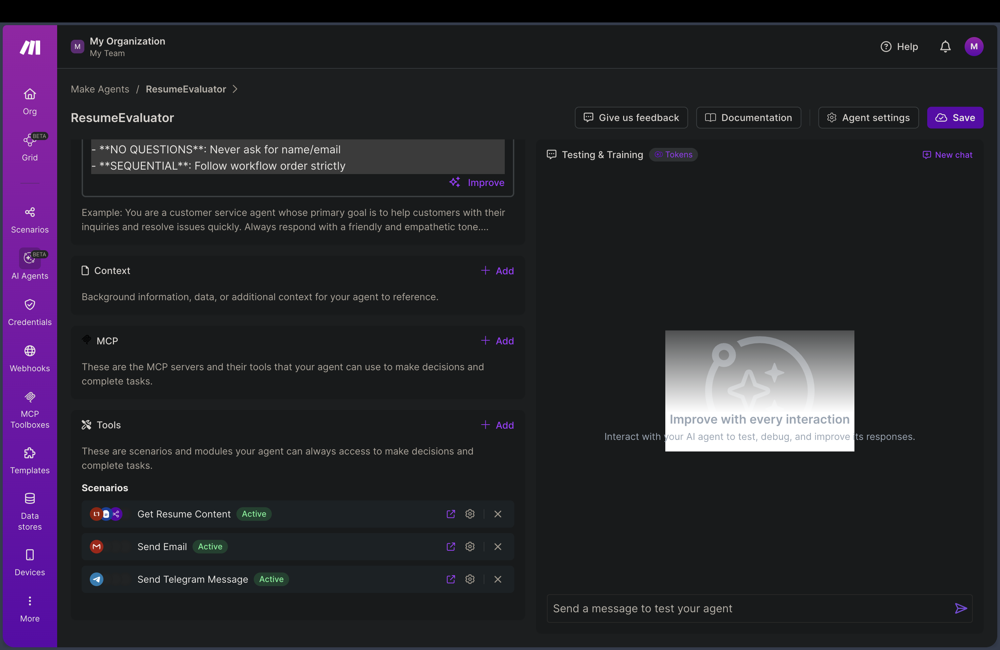
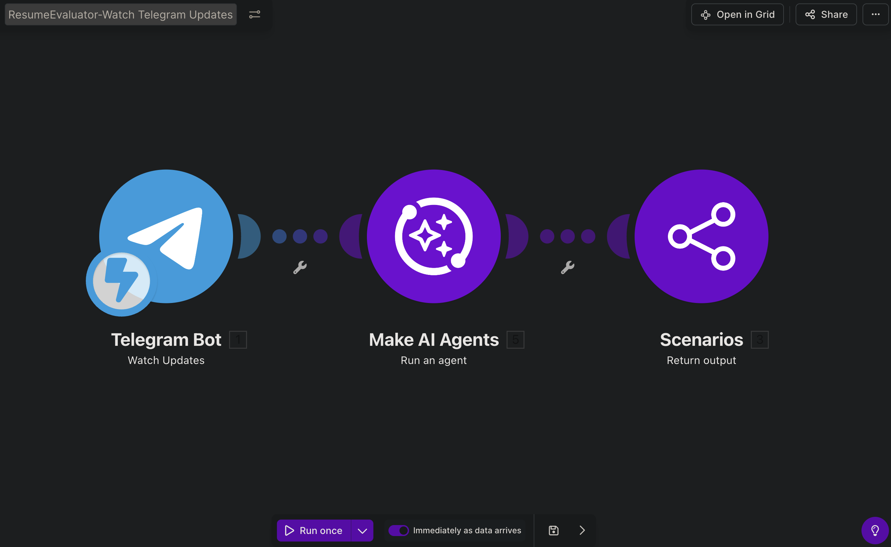
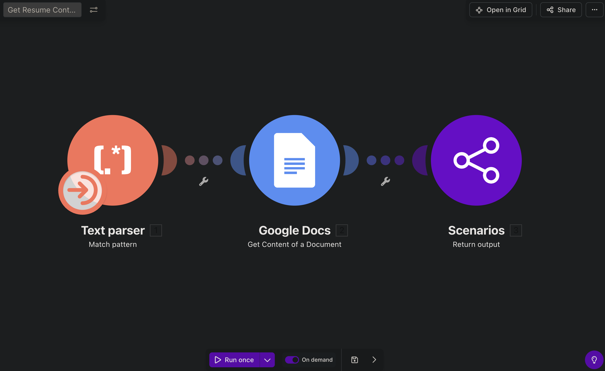
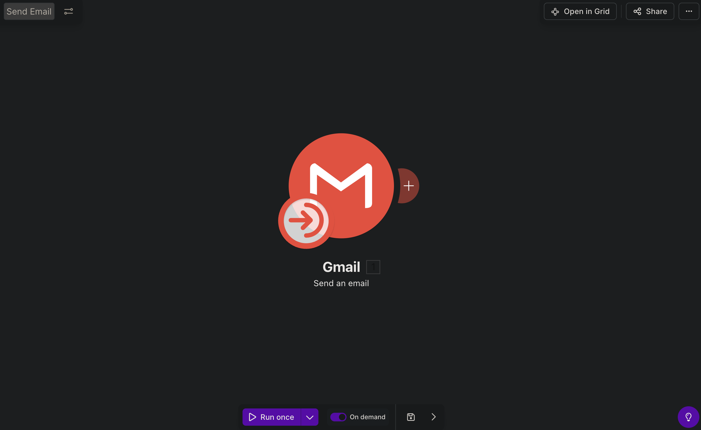
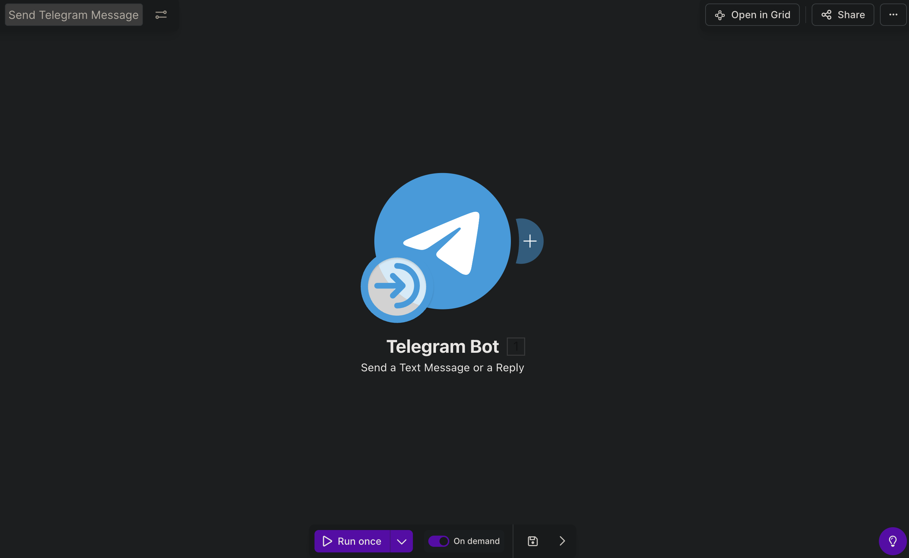
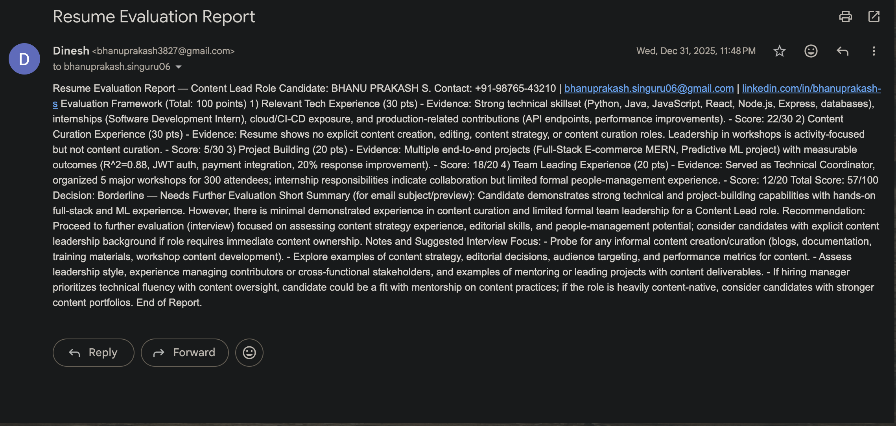

# Resume Evaluator

**Platform:** [Make.com](https://www.make.com) (AI Agent)

## Why I built it

I wanted a way to get quick, honest feedback on a resume draft without pulling in a person every time I tweak it — send it to a Telegram bot, get an evaluation back by email a minute later. Building it as a Make **AI Agent** rather than a fixed scenario meant the agent itself decides which of its tools to call and when, instead of me hardcoding that logic.

## How it works

This is four Make scenarios working together: one entry point, one AI Agent, and two scenarios exposed to that agent as callable tools.

```
Telegram — Watch Updates (entry scenario)
        │
        ▼
Make AI Agent — "ResumeEvaluator"
  ├─ Tool scenario: Get Resume Content   (regex-parses the doc link → pulls text via Google Docs API)
  ├─ Tool scenario: Send Email           (delivers the evaluation report)
  └─ Tool scenario: Send Telegram Message (delivers a quick in-chat reply)
        │
        ▼
scenario-service:ReturnData (sends Chat_ID back to the entry scenario)
```

1. **Entry point (`ResumeChecker_WatchUpdatesBot`)** — `telegram:WatchUpdates` catches an incoming Telegram message, then hands the chat ID and message text to `ai-agent:RunAnAIAgent`. The agent's instructions tell it to *immediately* acknowledge the user, then proceed through its tool sequence.
2. **Get Resume Content (tool)** — takes the resume link the user sent, regex-parses the Google Docs document ID out of the URL, then calls the Google Docs API to pull the document's raw text content back as `Resume_Content`.
3. **The agent evaluates** — with the resume text in hand, the agent (backed by an LLM configured on the Make AI Agent itself) produces the evaluation.
4. **Send Email (tool)** — delivers the evaluation as an HTML email, subject line `"Resume Evaluation Report"`, to the address the user provided.
5. **Send Telegram Message (tool)** — sends a shorter acknowledgment/summary back in the same Telegram chat, using the original `Chat_ID`.

The agent's system prompt is deliberately strict: **no follow-up questions for name/email** (don't stall the conversation asking for things it can infer or doesn't need), and **follow the tool sequence strictly** — fetch content, then evaluate, then deliver — rather than improvising the order.

## Setup

1. Create a Telegram bot via [@BotFather](https://core.telegram.org/bots#botfather).
2. Set up Make connections for **Telegram**, **Google Docs**, and **Google Email** (Gmail).
3. In Make, create an **AI Agent** (`ai-agent:RunAnAIAgent`) with the system prompt describing the resume-evaluation task, and attach the three tool scenarios below to it.
4. Get the four blueprint files (`watch-updates-bot`, `get-resume-content`, `send-email`, `send-telegram-message`) from the [Make.com Drive folder](https://drive.google.com/drive/folders/1mZilmpQAg4ntFNuvWaaeqHy10Gbz8DF4?usp=sharing) and import each into its own scenario.
5. **A Google OAuth client is required for the Docs/Email connections — generate your own `client_id`/`client_secret` in [Google Cloud Console](https://console.cloud.google.com/apis/credentials); never reuse or commit one you find in an example.**
6. Point the resume-sharing flow at documents you actually own/have "anyone with the link → viewer" access to, since `Get Resume Content` reads via the Docs API using your own Google connection.

## Gotchas / what I'd improve

- `Get Resume Content` assumes the link is specifically a **Google Docs** document — a resume shared as a PDF or a Docs link with restrictive sharing permissions will fail silently at the regex/API step.
- The agent's tools have no explicit error path back to the user if `Get Resume Content` fails (bad link, no access) — right now that would likely just stall the agent rather than tell the user what went wrong.
- Security note: the OAuth client credentials for the Google connection are **not included anywhere in this repo** — they're the kind of secret that should live only in your own Make connection, never in a shared blueprint.







## Output


