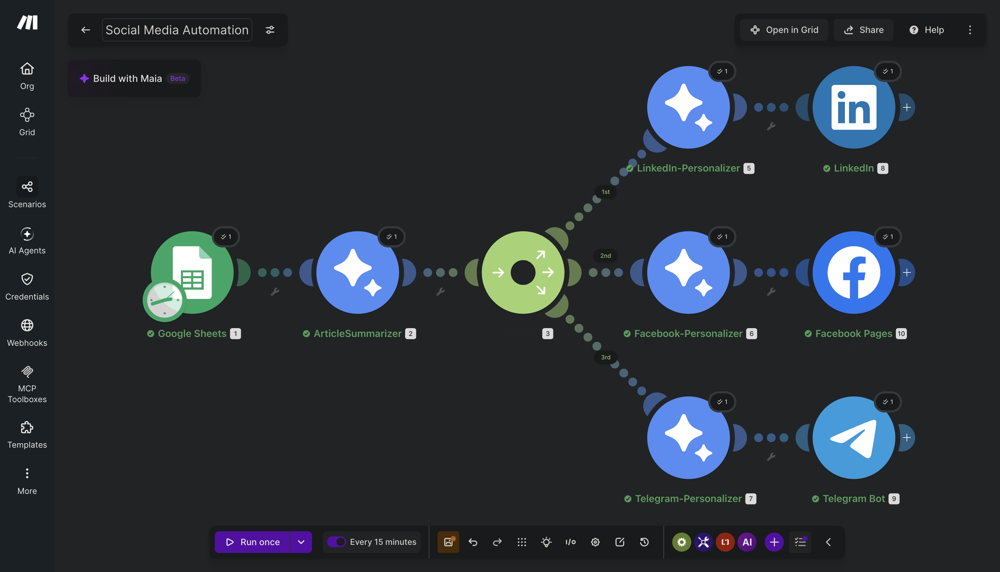
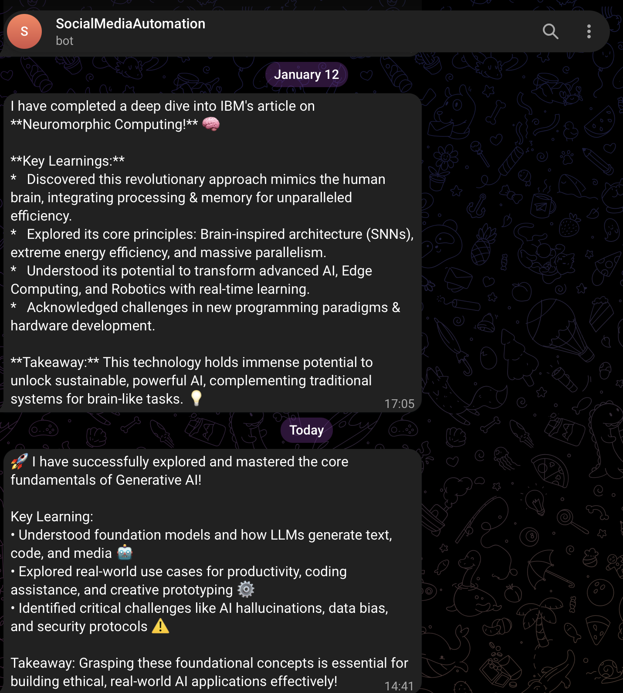

# Social Media Automation

**Platform:** [Make.com](https://www.make.com)

## Why I built it

Sharing what I build looks great for a job search, but writing a separate post for LinkedIn, Facebook, and Telegram every time I finish something is a task I'd realistically skip half the time. This turns one row in a spreadsheet into three platform-appropriate posts automatically, so "share this" stops being a chore that competes with actually building the next thing.

## How it works

```
Google Sheets — Watch Rows (poll)
        │
        ▼
Gemini — summarize the project/skill entry
        │
        ▼
    Basic Router
    ├──route 1──▶ Gemini (LinkedIn rewrite) ──▶ LinkedIn — Create Post (PUBLIC, main feed)
    ├──route 2──▶ Gemini (Facebook rewrite) ──▶ Facebook Pages — Create Post
    └──route 3──▶ Gemini (Telegram rewrite) ──▶ Telegram — Send Reply Message
```

Scheduled to poll every 15 minutes.

1. **Trigger** — `google-sheets:watchRows` polls a sheet for new rows (each row: a project or skill I want to showcase).
2. **Summarize** — the row's content goes to Gemini (`gemini-2.5-flash`) with a system instruction framing it as "a professional social media content creator helping students showcase their skills, projects, and learning journeys." Output: a plain-language summary.
3. **Router** — a Basic Router duplicates the summary into three parallel routes, one per platform.
4. **Per-platform rewrite** — each route calls Gemini again with a platform-specific prompt:
   - **LinkedIn:** structured as `Headline:` + a 2–3 paragraph summary — professional tone.
   - **Facebook:** structured as `Hook:` + `Personal Connection:` — more conversational, relatable framing.
   - **Telegram:** structured as a punchy headline + `Key Learning:` bullets — short-form, casual.
5. **Publish** — each rewritten post goes straight to its platform's native Make module: `linkedin:CreatePost` (public, main feed), `facebook-pages:CreatePost`, `telegram:SendReplyMessage`.

## Setup

1. Create a Google Sheet where each row represents one project/skill to showcase.
2. Connect **Google Sheets**, **Gemini AI**, **LinkedIn**, **Facebook Pages**, and **Telegram** modules in Make (each needs its own OAuth/API connection set up in Make's connection manager).
3. Get `blueprint.json` from the [Make.com Drive folder](https://drive.google.com/drive/folders/1mZilmpQAg4ntFNuvWaaeqHy10Gbz8DF4?usp=sharing) and import it into a new Make scenario.
4. Replace the Facebook `page_id` and Telegram `chatId` placeholders with your own.
5. Turn scheduling on (every 15 minutes, or whatever cadence fits your posting rhythm).

## Gotchas / what I'd improve

- Same summary text is rewritten three separate times by three separate Gemini calls — cheaper and just as effective would be one call that returns all three formats in a single structured JSON response, cutting the API calls from 4 to 2 per row.
- Every route publishes immediately with no review step — for a "showcase what I built" use case where I trust every row I add to the sheet, that's an acceptable trade for the lack of friction.
- The 15-minute poll means there's up to a 15-minute lag between adding a row and the post going out — fine for this use case, wouldn't suit anything time-sensitive.



## Output

Same summary, personalized per platform:

**LinkedIn**


**Facebook**


**Telegram**

