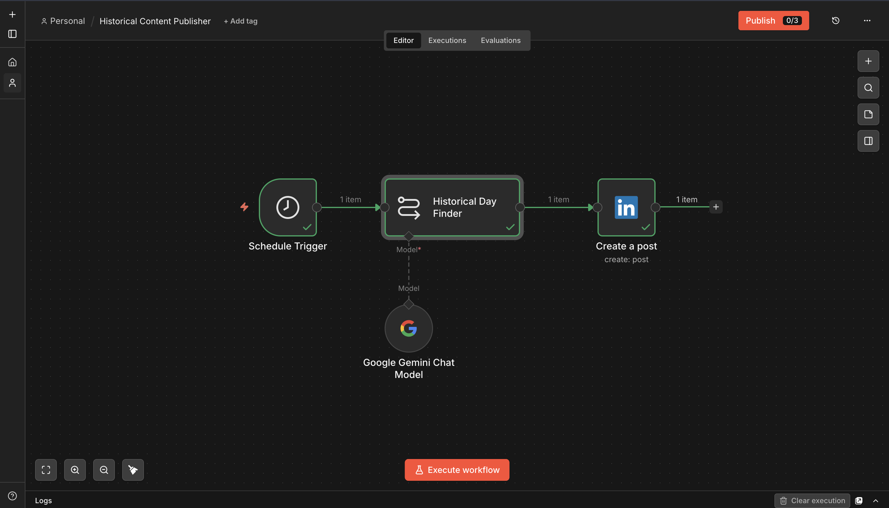

# Historical Content Publisher

**Platform:** [n8n](https://n8n.io)

## Why I built it

Consistent LinkedIn posting is the part of a job search everyone recommends and almost nobody keeps up with. This gives me a zero-effort daily post as a baseline — not the most valuable content I write, but it keeps the profile active every single day without me touching it.

## How it works

```
Schedule Trigger (daily, 7 AM)
        │
        ▼
Historical Day Finder ── Model: Google Gemini (gemini-3.5-flash-lite)
        │
        ▼
LinkedIn — Create a post
```

1. **Trigger** — Schedule Trigger, daily at 7 AM.
2. **Generate** — Gemini is given today's date (via n8n's `$now.toFormat('MMMM d')` expression) and asked to find one interesting historical event that happened on this date, then write it up as a LinkedIn post: hook ("On this day in [Year]..."), the event and its impact, a discussion question, and the hashtags `#OnThisDay #History #TodayInHistory`.
3. **Publish** — posts directly to LinkedIn via n8n's native LinkedIn node.

## Setup

1. Add a **Google Gemini** credential.
2. Add a **LinkedIn** credential (OAuth2 — you'll need a LinkedIn Developer app with the `w_member_social` scope).
3. Get `workflow.json` from the [n8n Drive folder](https://drive.google.com/drive/folders/16zvBvFm3g4V_ExoP4TraRaNTQBqnfw9B?usp=sharing) and import it into n8n.
4. Replace the `person` field in the `Create a post` node with your own LinkedIn person URN.

## Gotchas / what I'd improve

- Gemini is asked to "find" a historical fact but has no search tool wired in here — it's relying on parametric knowledge, so there's some risk of a subtly wrong date or fact slipping through unverified. Wiring in the SerpApi tool (like the [Learning Path Generator](../learning-path-generator) does) would make this more reliable.
- Fully autonomous posting means no human review step before something goes out under my name — for a personal brand account that's a trade-off worth being deliberate about, not a "set and forget forever" choice.



## Output


