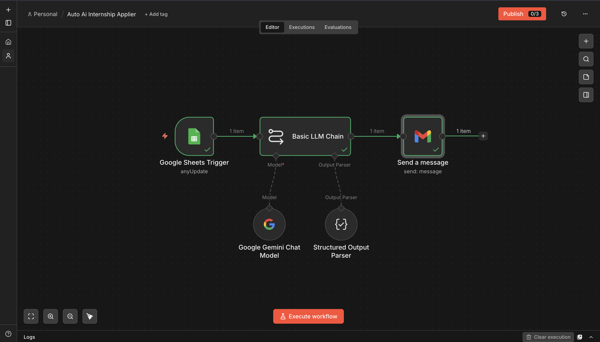
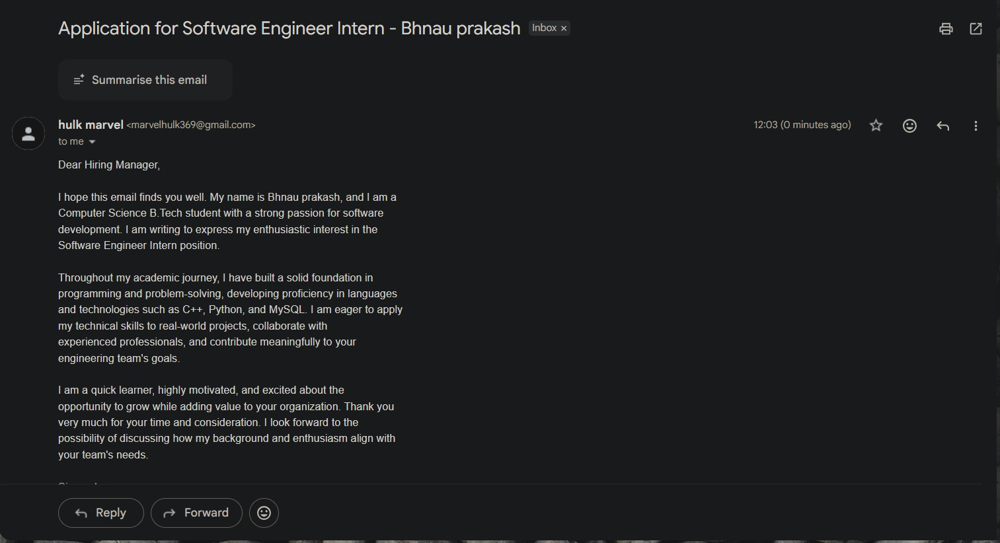
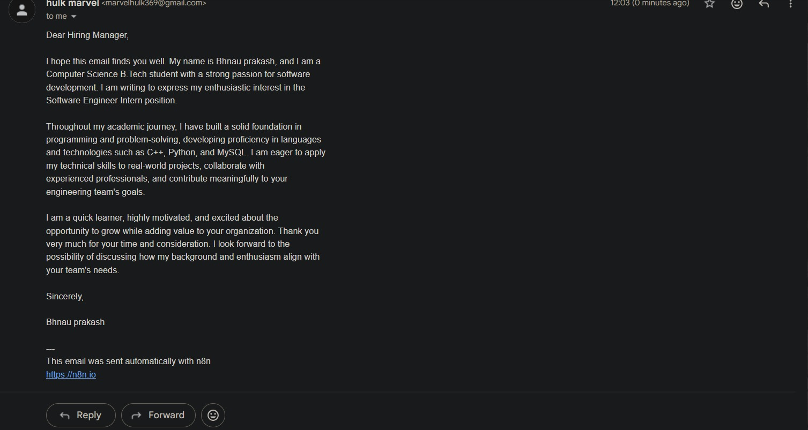

# Auto AI Internship Applier

**Platform:** [n8n](https://n8n.io)

## Why I built it

Internship hunting means writing the same "introducing myself" email over and over, tailored just enough per company that it doesn't feel copy-pasted. I was logging leads in a spreadsheet anyway, so I turned that spreadsheet into the trigger: add a row, get a drafted, ready-to-send application email in my inbox seconds later.

## How it works

```
Google Sheets Trigger (poll: every minute, anyUpdate)
        │
        ▼
Basic LLM Chain ── Model: Google Gemini (gemini-3.5-flash-lite)
        │           Output Parser: Structured Output Parser
        ▼
Gmail — Send a message
```

1. **Trigger** — a Google Sheets Trigger polls the tracking sheet every minute for any new/updated row (`anyUpdate` mode). Sheet columns: `Full Name`, `Email`, `Position Applied`, `Details`, `Experience (Years)`, `Skills`.
2. **Draft** — the row's fields are dropped into a prompt that tells Gemini to write a short, polite, formal-but-enthusiastic application email as a B.Tech student, using "Dear Hiring Manager," with no placeholder brackets left in — it has to be ready to send as-is.
3. **Structure** — a Structured Output Parser forces the model's reply into a fixed JSON shape (`to`, `subject`, `body`), so the next node never has to parse free text.
4. **Send** — the Gmail node maps `output.to` / `output.subject` / `output.body` straight into a real send.

## Setup

1. Create a Google Sheet with columns: `Full Name`, `Email`, `Position Applied`, `Details`, `Experience (Years)`, `Skills`.
2. Get `workflow.json` from the [n8n Drive folder](https://drive.google.com/drive/folders/16zvBvFm3g4V_ExoP4TraRaNTQBqnfw9B?usp=sharing) and import it into n8n.
3. Add credentials for **Google Sheets Trigger**, **Google Gemini** ([get a key](https://ai.google.dev)), and **Gmail** — all through n8n's credential manager, not hardcoded into the node.
4. Point the Google Sheets Trigger node at your sheet's document ID and tab.
5. Activate the workflow. Add a row → check your inbox.

## Gotchas / what I'd improve

- The Structured Output Parser is doing real work here — without it, the LLM chain's free-text output would need manual splitting into subject/body/recipient, and that's fragile the moment the model changes its formatting.
- Right now it fires on *any* sheet update, including edits to old rows — a "status" column with a Filter node ahead of the LLM chain would stop it from re-emailing on typo fixes.



## Output

Two live sends from the workflow:



