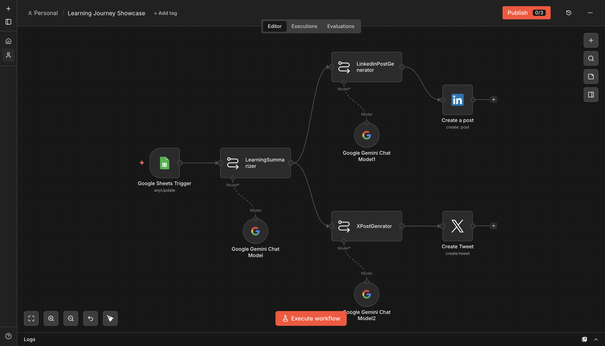
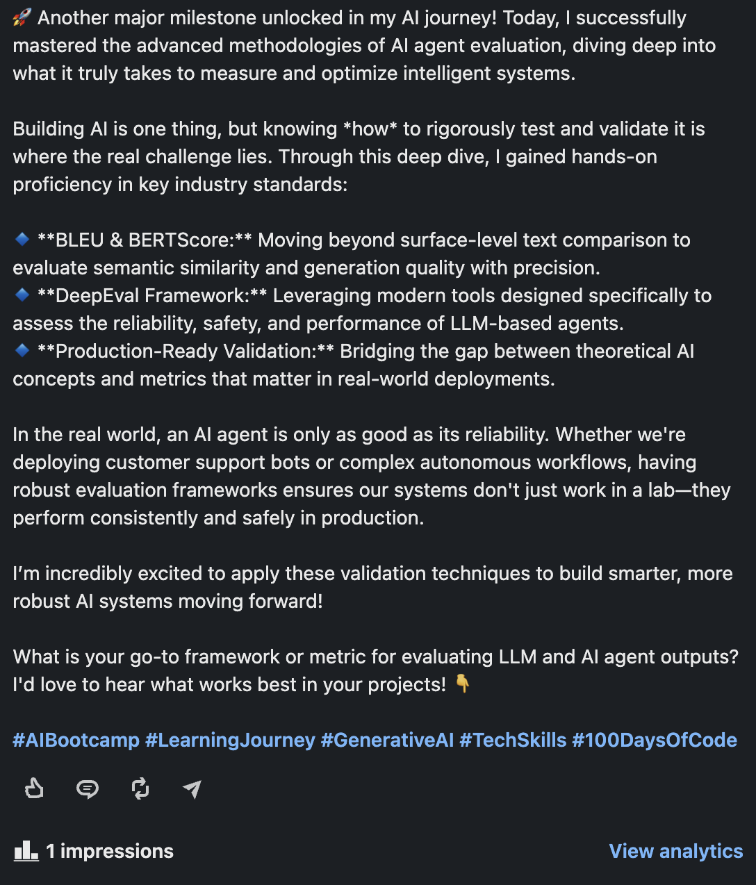

# Learning Journey Showcase

**Platform:** [n8n](https://n8n.io)

## Why I built it

I keep a daily log of what I'm learning in a spreadsheet, but a private log doesn't do anything for visibility. This turns each logged entry into a same-day LinkedIn post and a tweet, automatically, so "building in public" doesn't cost extra effort on top of the learning itself.

## How it works

```
Google Sheets Trigger (anyUpdate)
        │
        ▼
LearningSummarizer ── Model: Google Gemini
        │
        ├──▶ LinkedinPostGenerator ── Model: Gemini ──▶ LinkedIn — Create a post
        │
        └──▶ XPostGenrator ── Model: Gemini ──▶ Create Tweet (X)
```

1. **Trigger** — fires when a row is added/updated in a "Learning Journey Showcase" sheet with columns `Date`, `Topic/Module`, `What I Learned`, `Skills/Tools`.
2. **Summarize** — `LearningSummarizer` condenses the entry into a punchy, professional summary under 100 words, focused on the concept mastered and the practical skill gained.
3. **Fan out** — the summary feeds two parallel chains:
   - `LinkedinPostGenerator` — turns it into a 200–300 word LinkedIn post: hook → 2–3 specific insights → real-world reflection → hashtags (`#AIBootcamp #LearningJourney #GenerativeAI #TechSkills #100DaysOfCode`) → a question to the audience.
   - `XPostGenrator` — turns it into a sub-280-character tweet: milestone + one specific skill + a hashtag set (`#AI #Learning #TechJourney`).
4. **Publish** — each generator's output goes straight to its platform's native n8n node (LinkedIn / Twitter).

## Setup

1. Create a Google Sheet with columns `Date`, `Topic/Module`, `What I Learned`, `Skills/Tools`.
2. Add credentials for **Google Sheets**, **Google Gemini**, **LinkedIn**, and **Twitter/X**.
3. Get `workflow.json` from the [n8n Drive folder](https://drive.google.com/drive/folders/16zvBvFm3g4V_ExoP4TraRaNTQBqnfw9B?usp=sharing) and import it into n8n.
4. Point the Google Sheets Trigger at your log sheet, and update the LinkedIn node's `person` field to your own URN.

## Gotchas / what I'd improve

- Both posts publish automatically with no review step — for a personal log where every entry is genuinely presentable, that's fine; less fine if some days' notes are messier than others.
- `LearningSummarizer`, `LinkedinPostGenerator`, and `XPostGenrator` each spin up their own Gemini model connection rather than sharing one — works, just a bit more setup overhead than necessary.



## Output


