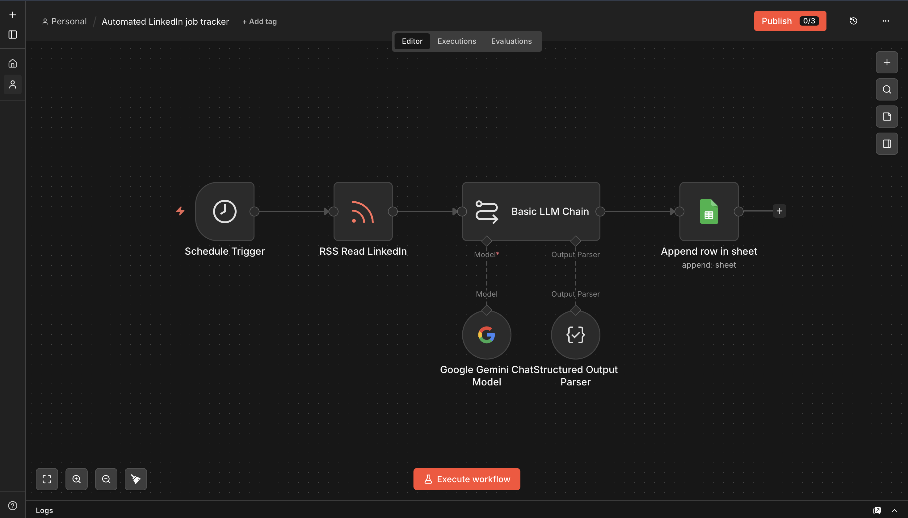

# Automated LinkedIn Job Tracker

**Platform:** [n8n](https://n8n.io)

## Why I built it

Manually screenshotting or copy-pasting every relevant LinkedIn posting into a tracker gets old fast — and by the time I'd get around to writing a cover letter, I'd have forgotten which skills the posting actually asked for. This runs once a day, reads every new posting, and hands me a spreadsheet row with the skills already extracted and a cover letter already drafted.

## How it works

```
Schedule Trigger (daily, 7 AM)
        │
        ▼
RSS Read LinkedIn (FetchRSS feed)
        │
        ▼
Basic LLM Chain ── Model: Google Gemini (gemini-3.5-flash-lite)
        │           Output Parser: Structured Output Parser
        ▼
Google Sheets — Append row in sheet
```

1. **Trigger** — a Schedule Trigger fires once a day at 7 AM.
2. **Ingestion** — LinkedIn doesn't expose a native RSS feed, so this reads a [FetchRSS](https://fetchrss.com)-generated feed that mirrors a saved LinkedIn job search as RSS.
3. **Analyze** — each item's title, link, publish date, and description go to Gemini with a "career advisor + technical recruiter" prompt: extract every technical skill (explicit and implied), then write a 250–300 word cover letter structured as opening → relevant skills → enthusiastic close.
4. **Structure** — a Structured Output Parser locks the reply into `Title`, `Link`, `Published Date`, `About Company and job description`, `skills`, `cover letter`.
5. **Log** — appends one row per posting to a tracking sheet, matched on the `Title` column so re-runs don't duplicate rows.

## Setup

1. Set up a saved LinkedIn job search, then generate an RSS mirror of it via [FetchRSS](https://fetchrss.com) (or any similar RSS-from-page service).
2. Create a Google Sheet with columns matching the schema above.
3. Get `workflow.json` from the [n8n Drive folder](https://drive.google.com/drive/folders/16zvBvFm3g4V_ExoP4TraRaNTQBqnfw9B?usp=sharing) and import it into n8n.
4. Add credentials for **Google Gemini** and **Google Sheets**.
5. Replace the `RSS Read LinkedIn` node's URL with your own FetchRSS feed URL.
6. Point the Google Sheets node at your tracker sheet's document ID.

## Gotchas / what I'd improve

- FetchRSS feeds refresh on their own schedule (not instant) — the 7 AM daily trigger is tuned to that, not to LinkedIn's actual posting cadence.
- Matching on `Title` to avoid duplicates breaks if two different postings share an identical title — matching on `Link` would be more reliable.



## Output

Tracked postings land in [`LinkedIn-Job-Tracker.xlsx`](LinkedIn-Job-Tracker.xlsx).
