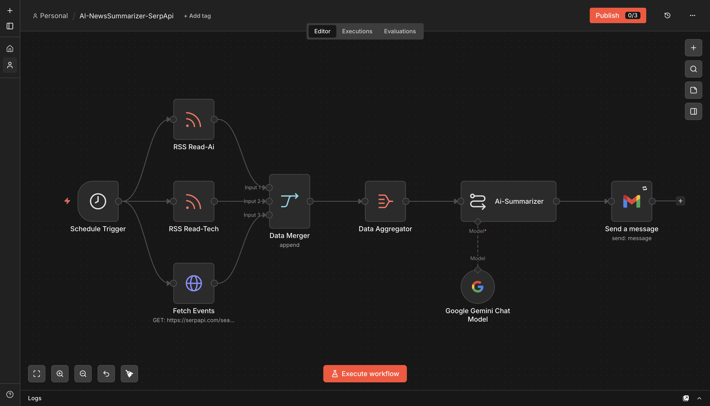
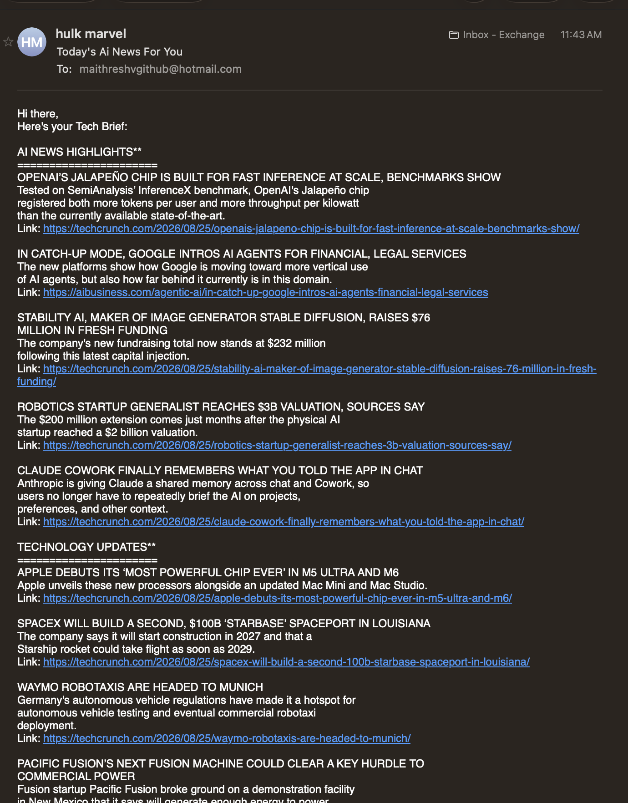
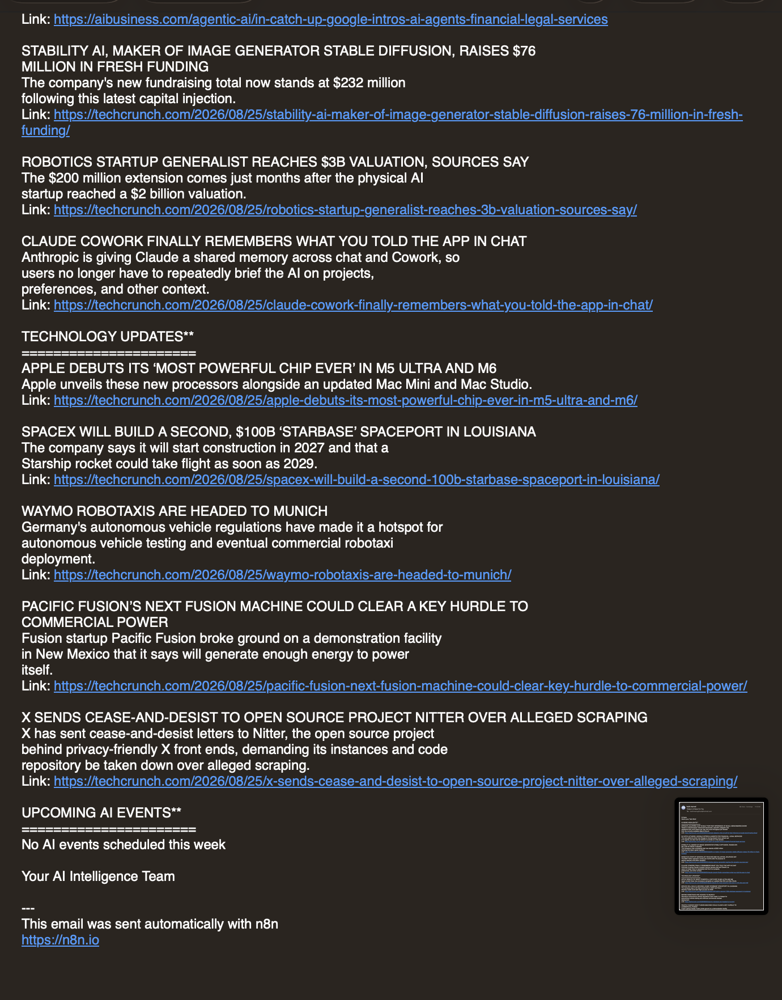

# AI News Summarizer (SerpApi)

**Platform:** [n8n](https://n8n.io)

## Why I built it

I wanted one email each morning instead of three apps open at once (an AI newsletter, TechCrunch, and a manual search for "what AI events are happening this week"). This pulls all three into one Gemini-written brief.

## How it works

```
Schedule Trigger (daily, 7 AM)
   ├──▶ RSS Read-Ai   (aibusiness.com/rss.xml) ──┐
   ├──▶ RSS Read-Tech (techcrunch.com/feed/)  ────┼──▶ Data Merger (3 inputs) ──▶ Data Aggregator ──▶ Ai-Summarizer (Gemini) ──▶ Gmail — Send a message
   └──▶ Fetch Events  (SerpApi, google_events)────┘
```

1. **Trigger** — Schedule Trigger, daily at 7 AM, fans out to three parallel branches.
2. **AI news** — RSS feed from [AIBusiness](https://aibusiness.com).
3. **Tech news** — RSS feed from [TechCrunch](https://techcrunch.com).
4. **Events** — an HTTP request to [SerpApi](https://serpapi.com)'s `google_events` engine, querying `"Ai Tech Events"` (`hl=en`, `gl=us`) using n8n's built-in SerpApi credential type.
5. **Merge** — a Merge node (3 inputs) combines all three branches into one stream, then an Aggregate node (`aggregateAllItemData`) flattens it into a single item.
6. **Summarize** — Gemini gets a strict prompt: only use the provided items (never invent content), and lay the output out under three fixed headers — AI NEWS HIGHLIGHTS, TECHNOLOGY UPDATES, UPCOMING AI EVENTS — each item as `HEADLINE`, 1–2 sentence summary, and a link.
7. **Deliver** — sends the digest by Gmail.

## Setup

1. Get a free/paid [SerpApi key](https://serpapi.com) and add it as an n8n SerpApi credential.
2. Add a **Google Gemini** credential ([ai.google.dev](https://ai.google.dev)) and a **Gmail** credential.
3. Get `workflow.json` from the [n8n Drive folder](https://drive.google.com/drive/folders/16zvBvFm3g4V_ExoP4TraRaNTQBqnfw9B?usp=sharing) and import it into n8n.
4. Swap the RSS URLs for whatever sources you actually want summarized, and change the SerpApi `q` parameter if you want a different event search.
5. Update the Gmail node's `sendTo` to your own address.

## Gotchas / what I'd improve

- "Do not invent content" in the prompt matters more than it looks — without that line, Gemini will happily fabricate a plausible-sounding event when the SerpApi results come back empty.
- Three parallel branches into one Merge node means the workflow is only as fast as the slowest branch (usually the SerpApi call) — fine for a daily digest, would need reworking for anything near-real-time.



## Output



