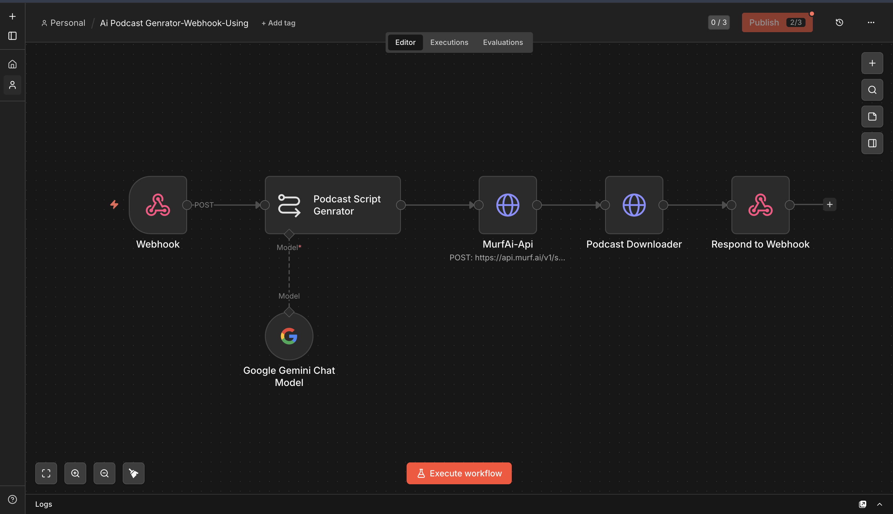
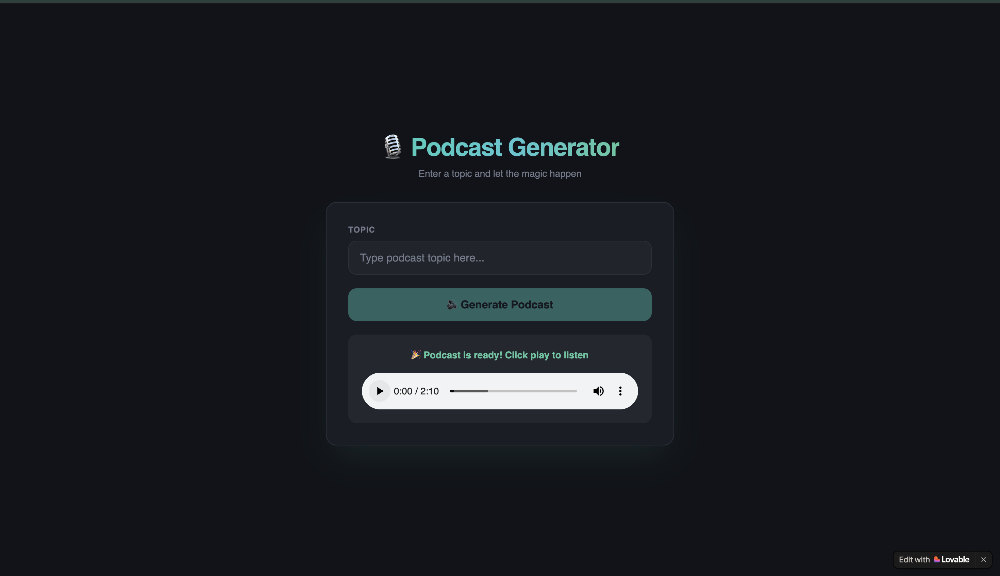

# AI Podcast Generator (Webhook Backend)

**Platform:** [n8n](https://n8n.io)

## Why I built it

This is the automation backend behind **PodEase Pro**, a frontend I built in Lovable — the idea being: type a topic, get back a short, listenable podcast episode without recording anything yourself. n8n does the actual work; the frontend just calls a webhook and waits.

## How it works

```
Webhook (POST, path: <webhook-id>)
        │
        ▼
Podcast Script Genrator ── Model: Google Gemini
        │
        ▼
MurfAi-Api (POST → MurfAI TTS)
        │
        ▼
Podcast Downloader (GET the generated audio file)
        │
        ▼
Respond to Webhook
```

1. **Trigger** — a Webhook node receives a `POST` with `{ text: "<topic>" }` from the PodEase Pro frontend.
2. **Script** — Gemini is prompted to act as "a professional podcast script writer" and produce a conversational, ~2-minute script on the given topic — plain text only, no headings or formatting, friendly and informative tone.
3. **Voice** — the script is POSTed to [MurfAI's](https://murf.ai) `speech/generate` endpoint with a chosen voice (`Ronnie`, `en-IN` locale), which returns a URL to the generated audio file.
4. **Fetch** — a second HTTP Request downloads that audio file.
5. **Respond** — `Respond to Webhook` sends the audio back to the frontend that called it.

## Setup

1. Get a [MurfAI API key](https://murf.ai).
2. Add a **Google Gemini** credential.
3. Get `workflow.json` from the [n8n Drive folder](https://drive.google.com/drive/folders/16zvBvFm3g4V_ExoP4TraRaNTQBqnfw9B?usp=sharing) and import it into n8n.
4. Activate the workflow to get a live webhook URL, and point your frontend (or `curl`/Postman for testing) at it:
   ```bash
   curl -X POST https://<your-n8n-instance>/webhook/<path> \
     -H "Content-Type: application/json" \
     -d '{"text": "the history of the internet"}'
   ```
5. Choose your own MurfAI `voiceId` and `multiNativeLocale` in the `MurfAi-Api` node.

## Gotchas / what I'd improve

- No timeout/retry handling around the MurfAI call — if generation takes longer than the webhook's response window, the frontend request just hangs.
- The webhook path itself acts as the only access control on this endpoint (no auth header check) — fine for a personal demo, not for anything public-facing without adding a shared secret or n8n's built-in webhook authentication.



## Frontend

The consumer-facing app that calls this webhook:


