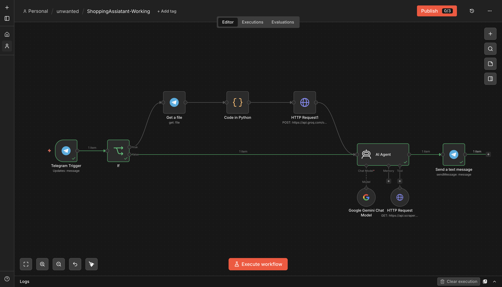
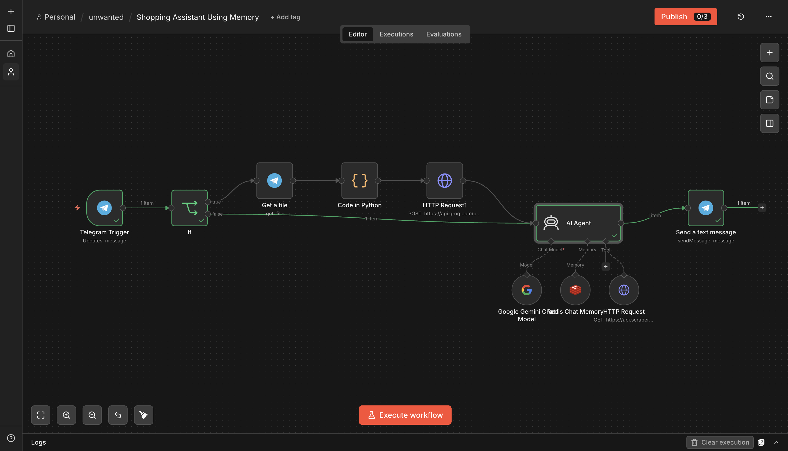
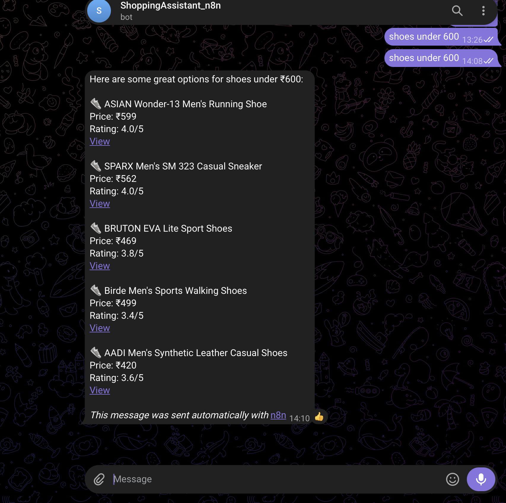

# Shopping Assistant

**Platform:** [n8n](https://n8n.io)

## Why I built it

I wanted a shopping assistant I could actually talk to on Telegram and have it either search Amazon for me or give real styling advice, without having to repeat my preferences every message. That's why v2 exists: the first version had no memory, so every message started from zero.

There are two versions in this folder — both included because the upgrade path itself is worth showing. **v1** accepted text or a product photo (routed to a vision model). **v2** replaced the photo branch with voice input and added persistent memory — so as of v2, the assistant only accepts **text or voice**, not images.

## v1 — Working version

```
Telegram Trigger (Updates: message)
        │
        ▼
       If ──true (has image)──▶ Get a file ──▶ Code in Python ──▶ HTTP Request1 (POST → Groq vision API) ──▶ AI Agent
        │
       false (text only) ─────────────────────────────────────────────────────────────────────▶ AI Agent
                                                                                                     │
                                                                                  Chat Model: Gemini │  Tool: HTTP Request → ScraperAPI
                                                                                                     ▼
                                                                                    Telegram — Send a text message
```

- Branches on whether the incoming Telegram message has an image attached.
- **Image branch:** downloads the file, a Python code node preprocesses it, then POSTs it to Groq for vision-based product identification.
- **Text branch:** goes straight to the AI Agent, which uses Gemini as the reasoning model and a ScraperAPI-backed HTTP Request tool to pull live Amazon results.
- No memory — every message is a fresh conversation.

## v2 — Text or voice only, plus persistent memory

```
Telegram Trigger (Updates: message)
        │
        ▼
       If ──true (voice message exists)──▶ Get a file ──▶ Code in Python (rename .oga→.ogg) ──▶ HTTP Request1 (POST → Groq Whisper transcription) ──▶ AI Agent
        │
       false (text message)────────────────────────────────────────────────────────────────────────────────────────────────────────────────────▶ AI Agent
                                                                                                                                                          │
                                                                                                          Chat Model: Gemini (flash-lite) │ Memory: Redis │ Tool: ScraperAPI
                                                                                                                                                          ▼
                                                                                                                                            Telegram — Send a text message
```

**v2 intentionally drops photo support.** The `If` node's only branch condition is whether `$json.message.voice` exists — there's no image check anymore, so the vision pipeline from v1 (`Get a file` → Python → Groq vision) isn't present in this version at all. The two supported inputs are:
- **Voice note** → true branch → transcribed by Groq Whisper → fed to the AI Agent as text.
- **Typed text** → false branch → straight to the AI Agent.

If a photo is sent to v2, it falls into the `false` branch same as text, but `$json.message.text` is empty for a photo message — so the agent receives no usable input. Photo support would need to be re-added deliberately (see Gotchas below) if you want both.

This is the same overall shape as v1, but two things changed:

1. **Voice support, for easier access.** The `If` node now checks `$json.message.voice` instead of an image. If the user sends a voice note, n8n downloads it via Telegram's `Get a file`, a Python code node fixes the file extension (Telegram delivers `.oga`, but the transcription API expects `.ogg`), and it's POSTed to **[Groq's](https://groq.com) Whisper transcription endpoint** (`whisper-large-v3-turbo`, `POST /openai/v1/audio/transcriptions`) as multipart form data. The transcript then feeds into the AI Agent exactly like typed text would — so you can just talk to it, tap send, and get a reply without typing at all, which is the point of doing this on a mobile-first surface like Telegram.
2. **Persistent memory.** A **Redis Chat Memory** node is now wired into the AI Agent's memory input, keyed by the Telegram `chatId` as a custom session key (`sessionTTL: 0`, i.e. no expiry). That means the agent remembers your sizing, style preferences, and earlier turns in the conversation instead of treating every message as a cold start.

The agent's system prompt ("Maya, a shopping and styling assistant") handles two jobs:
- **Product search** — builds an Amazon India search URL (`amazon.in/s?k=...`) from the user's request, calls the ScraperAPI tool with that URL, and parses out product name/price/rating/link for the top 5 results.
- **Styling advice** — asks clarifying questions (occasion, style, color, season) before giving personalized tips, instead of jumping straight to a search.

Currently text-out only — there's no text-to-speech step, so voice notes in get a typed reply back, not a spoken one.

## Setup

1. Create a Telegram bot via [@BotFather](https://core.telegram.org/bots#botfather) and add it as an n8n Telegram credential.
2. Get a [Groq API key](https://groq.com) for both the vision (v1) and Whisper transcription (v2) calls.
3. Get a [ScraperAPI key](https://www.scraperapi.com) for the product-search tool.
4. Get a [Google Gemini key](https://ai.google.dev) for the chat model.
5. For v2's memory: stand up a Redis instance (local, Docker, or a managed service) and add it as an n8n Redis credential.
6. Get `workflow.json` (v1) and `workflow-v2-memory.json` (v2) from the [n8n Drive folder](https://drive.google.com/drive/folders/16zvBvFm3g4V_ExoP4TraRaNTQBqnfw9B?usp=sharing) and import whichever version into n8n.
7. Replace the Telegram `chatId` placeholder with your own chat ID for testing.

## Gotchas / what I'd improve

- All the API keys in the original build were hardcoded directly into the HTTP Request node's query/header parameters instead of using n8n's credential store — the JSON in the Drive folder has every key replaced with a placeholder; use proper credentials when you set this up yourself.
- The `.oga` → `.ogg` rename is a real gotcha: Telegram voice notes come down as Ogg/OPUS with a `.oga` extension, and some transcription APIs are picky about the extension matching the container — Groq's endpoint wanted `.ogg`.
- No TTS yet — a natural next step would be piping the agent's reply through MurfAI (already used in the [Podcast Generator](../podcast-generator)) to close the loop with a spoken response.
- v2 dropped photo input entirely rather than supporting all three (text/voice/photo) at once — a three-way `Switch` node (voice / photo / text) instead of a two-way `If` would let a future version keep v1's vision search and v2's voice + memory together.
- `sessionTTL: 0` means memory never expires — fine for a personal bot with one user, but would need a real TTL or per-user cleanup for anything multi-tenant.




## Output


