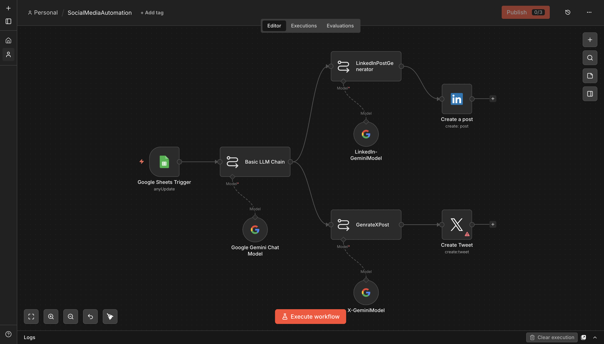
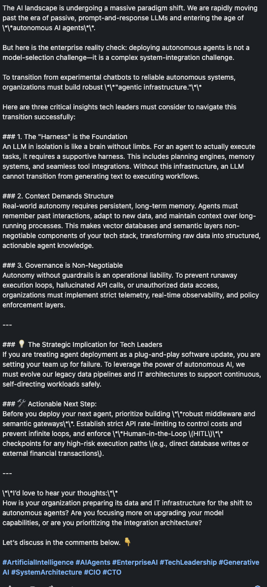

# Social Media Automation (n8n)

**Platform:** [n8n](https://n8n.io)

## Why I built it

This is an n8n rebuild of the same idea behind the [Make.com Social Media Automation](../../make.com/social-media-automation) project — turn an interesting article into platform-ready posts — but scoped down to LinkedIn + X and driven off a simple article-link sheet instead of Make's router-based multi-platform fanout. Building the same concept twice on two platforms was deliberate: it's the clearest way to compare how much more control n8n's explicit node graph gives you versus Make's visual router, for the same job.

## How it works

```
Google Sheets Trigger (anyUpdate, sheet: ArticleLinks)
        │
        ▼
Basic LLM Chain ── Model: Google Gemini — summarizes the article
        │
        ├──▶ LinkedInPostGenerator ── Model: Gemini ──▶ LinkedIn — Create a post
        │
        └──▶ GenrateXPost ── Model: Gemini ──▶ Create Tweet (X)
```

1. **Trigger** — fires when a new link is added to an `ArticleLinks` sheet tab.
2. **Summarize** — the Basic LLM Chain acts as a "social media strategist," pulling the 3 most important insights, any actionable advice, and the audience implications from the linked article, capped under 200 words.
3. **Fan out:**
   - `LinkedInPostGenerator` — writes as an "industry expert," under 3,000 characters, with analysis tied to AI industry trends and a professional call to action.
   - `GenrateXPost` — writes a sub-30-word, sharp-insight tweet with a discussion-provoking question.
4. **Publish** — each output posts directly via the LinkedIn and Twitter/X nodes.

## Setup

1. Create a Google Sheet with an `ArticleLinks` tab and a `Links` column (the article URL or text to summarize).
2. Add credentials for **Google Sheets**, **Google Gemini**, **LinkedIn**, and **Twitter/X**.
3. Get `workflow.json` from the [n8n Drive folder](https://drive.google.com/drive/folders/16zvBvFm3g4V_ExoP4TraRaNTQBqnfw9B?usp=sharing) and import it into n8n.
4. Update the LinkedIn node's `person` field to your own URN.

## Gotchas / what I'd improve

- The `Links` column is passed straight into the prompt as `{{ $json.Links }}` — if it's a bare URL rather than article text, Gemini is summarizing from its own knowledge of that URL (if any) rather than the live page content. Adding an HTTP Request + HTML extraction step before the LLM chain would make this accurate for any link, not just well-known ones.
- No Telegram or Facebook branch here (unlike the Make.com version) — this build is intentionally narrower in scope, focused on the two platforms where I actually post.



## Output


