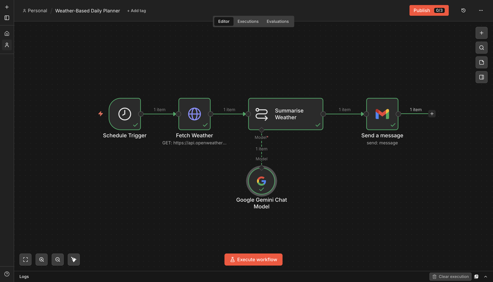
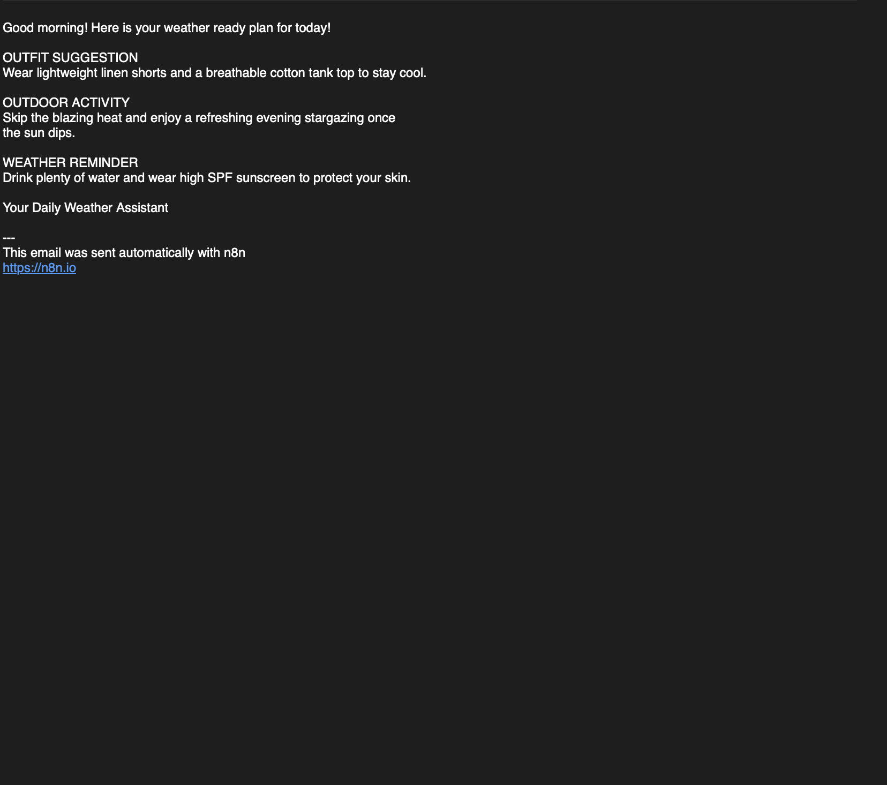

# Weather-Based Daily Planner

**Platform:** [n8n](https://n8n.io)

## Why I built it

A small, low-effort automation — I wanted a daily nudge on what to wear and whether outdoor plans made sense, without opening a weather app first thing in the morning.

## How it works

```
Schedule Trigger (daily, 7 AM)
        │
        ▼
Fetch Weather (GET → OpenWeatherMap)
        │
        ▼
Summarise Weather ── Model: Google Gemini (gemini-3.5-flash-lite)
        │
        ▼
Gmail — Send a message
```

1. **Trigger** — Schedule Trigger, daily at 7 AM.
2. **Fetch** — a GET request to [OpenWeatherMap's](https://openweathermap.org) current-weather endpoint for a hardcoded city, returning temperature, condition, and humidity.
3. **Plan** — Gemini turns the raw numbers into a short, friendly plan with three fixed sections: OUTFIT SUGGESTION, OUTDOOR ACTIVITY, WEATHER REMINDER — capped under 100 words, no markdown, conversational tone.
4. **Deliver** — sends the plan by Gmail.

## Setup

1. Get a free [OpenWeatherMap API key](https://openweathermap.org/api).
2. Add **Google Gemini** and **Gmail** credentials.
3. Get `workflow.json` from the [n8n Drive folder](https://drive.google.com/drive/folders/16zvBvFm3g4V_ExoP4TraRaNTQBqnfw9B?usp=sharing) and import it into n8n.
4. Update the `Fetch Weather` node's `q` query parameter to your own city.
5. Update the Gmail node's `sendTo` address.

## Gotchas / what I'd improve

- The city is hardcoded in the query string rather than looked up by IP/location — fine for a personal automation, wouldn't scale to multiple users without a per-user city field.
- No error handling if OpenWeatherMap is down or rate-limited — the LLM node would just get an empty/error payload and hallucinate a plan around it.



## Output


